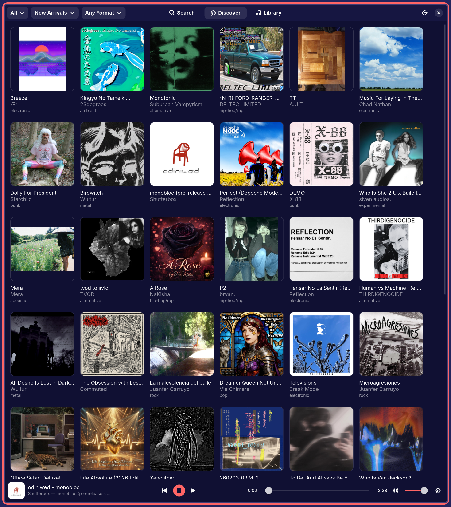

# Camper

A minimalistic Bandcamp music player client for Linux, built with Rust, GTK4/libadwaita, and GStreamer.



## Features

- **Search**: Find albums across all of Bandcamp
- **Discover**: Browse new releases filtered by genre, sort, and format
- **Library**: View your purchased collection and wishlist
- **GStreamer Playback**: Stream music with media controls and seek bar
- **MPRIS Integration**: Media keys and desktop player integration
- **Session Persistence**: Stay logged in across restarts
- **Open in Browser**: Quick-open album pages from the player bar

## Building

### With Nix (recommended)

```bash
nix develop
cargo build --release
./target/release/camper
```

### Without Nix

Dependencies: Rust 1.70+, GTK4, libadwaita, WebKitGTK 6.0, GStreamer (with plugins-base, plugins-good, plugins-bad)

```bash
cargo build --release
```

## Usage

1. Launch the application
2. Log in to your Bandcamp account via the embedded browser
3. Browse your library, search for music, or discover new releases
4. Click an album to start playing

## License

MIT
