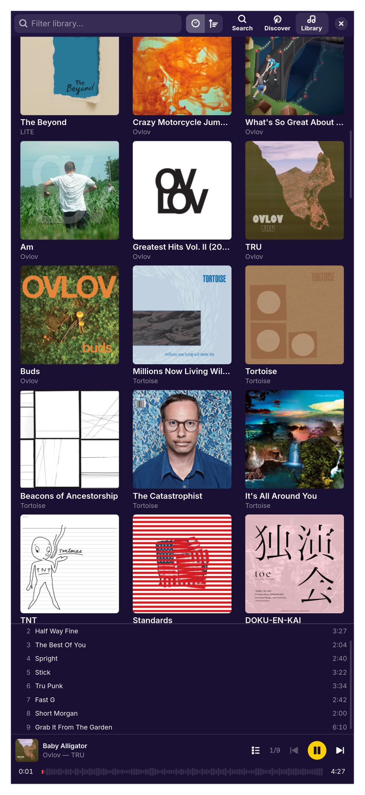
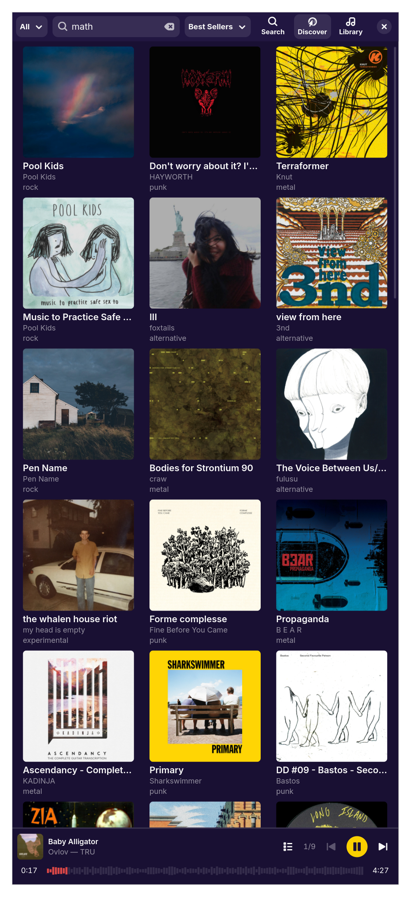

# Camper

A minimalistic Bandcamp music player client for Linux, built with Rust, GTK4/libadwaita, and GStreamer.

| Library                                 | Discover                                  | Search                                |
| --------------------------------------- | ----------------------------------------- | ------------------------------------- |
|  |  |  |

## Features

- **Search**: Find artists, albums, and tracks across Bandcamp
- **Discover**: Browse releases filtered by genre, tag, and sort
- **Library**: View your purchased collection and wishlist
- **GStreamer Playback**: Stream music with media controls and seek bar
- **Track List Controls**: Toggle the queue list and jump to any track
- **MPRIS Integration**: Media keys and desktop player integration
- **Session Persistence**: Stay logged in across restarts
- **Open in Browser**: Quick-open album pages from the player bar

## Installation

### With Nix (recommended)

```bash
nix run github:knoopx/camper
```

### From the [AUR](https://aur.archlinux.org/packages/camper-git) (community maintained)

```bash
yay -S camper-git
```

### From source

Dependencies: Rust 1.70+, GTK4, libadwaita, WebKitGTK 6.0, GStreamer (with plugins-base, plugins-good, plugins-bad)

```bash
nix develop --command cargo run
```

## Usage

1. Launch the application
2. Log in to your Bandcamp account via the embedded browser
3. Browse your library, search for music, or discover new releases
4. Click an album to start playing

## License

MIT
